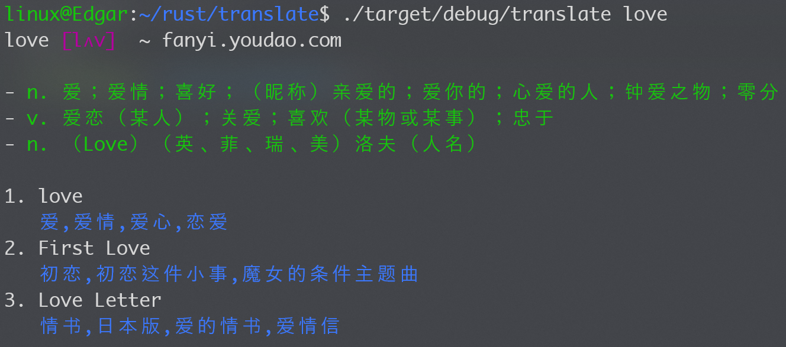

## Translate

A CN and US translate tool in  command line, inspired by [fanyi](https://github.com/afc163/fanyi).


### Usage

```bash
cargo run -- hello

cargo run -- "hello world"
```

### Build

```bash
cargo build --release
```

### Demo



